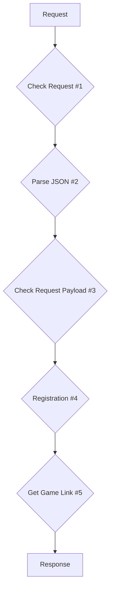

# API Service Documentation: Admins

### POST /admins Create an Admin account

#### Request

```http
POST https://{{host}}/v1/admins HTTP/2.0
Content-Type: application/json

{
    "secret": {{secret}},
    "email": {{email}},
    "username": {{username}},
    "password": {{password}}
}
```

- Header

| Parameter    | Type   | Description                             |
| ------------ | ------ | --------------------------------------- |
| Content-Type | string | indicate the media type of the resource |

- Body

| Parameter | Type   | Description                              |
| --------- | ------ | ---------------------------------------- |
| secret    | string | The secret key dispatch by game provider |
| email     | string | The admin account's email                |
| username  | string | The admin account's username             |
| password  | string | The admin account's password             |

#### Respoonse

A successful request returns the HTTP `201 Created` status code.

```json
{
  "data": {
    "admin_id": "04773c00cef59479d30bf9f026c8fed9",
    "email": "egg734631@gmail.com",
    "username": "kayac"
  }
}
```

- data

| Parameter | Type   | Description                  |
| --------- | ------ | ---------------------------- |
| admin_id  | string | The admin account's id       |
| email     | string | The admin account's email    |
| username  | string | The admin account's username |

#### Errors Types

### Program Flow



#### Check Content-Type #1

#### Parse JSON #2

#### Check Request Payload #3

#### Check Admin Email Already Exist #4

#### Create Admin Account #5
